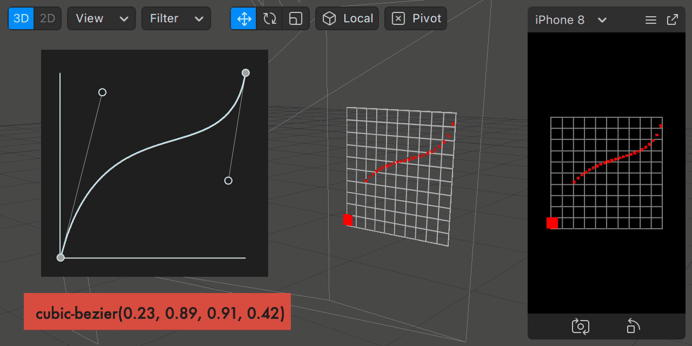

# BezierEasing.ts



**BezierEasing** provides **Cubic Bezier** curve easing which generalizes easing functions (`ease-in`, `ease-out`, `ease-in-out`, ...any other custom curve) exactly like in [CSS Transitions](https://cubic-bezier.com/#.17,.67,.83,.67).

The repo is based on [gre](https://github.com/gre)/**[bezier-easing](https://github.com/gre/bezier-easing)**, and converted to [reactive for Spark AR](https://sparkar.facebook.com/ar-studio/learn/scripting/reactive-programming).


## Install

[](https://npmjs.org/package/sparkar-bezier-easing-ts)

You can download script and import into your project, or use this with npm.

0. Download [BezierEasing.ts](https://github.com/pofulu/sparkar-bezier-easing/raw/develop/BezierEasingDemo/scripts/BezierEasing.ts) (Right click and Save as)
1. Drag/Import it into your project. ([Spark AR support TypeScript since v105](https://sparkar.facebook.com/ar-studio/learn/scripting/typescript-support))
2. You can also [Click Here to Download Sample Project](https://github.com/pofulu/sparkar-bezier-easing/releases/latest/download/BezierEasingDemo.arprojpkg).


## Usage

You can generate the cubic-bezier value at [cubic-bezier.com](https://cubic-bezier.com/) or [cubic-bezier-generator](https://jakcharvat.github.io/cubic-bezier-generator/).

```javascript
import BezierEasing from './BezierEasing';

const easing = new BezierEasing(0, 0, 1, 0.5);
// easing allows to project x in [0.0,1.0] range onto the bezier-curve defined by the 4 points (see schema below).

// use number
easing.evaluate(0);		// Reactive.val(0.0)
easing.evaluate(0.5);	// Reactive.val(0.3125)
easing.evaluate(1);		// Reactive.val(1.0)

// use signal;
const Time = require('Time');
easing.evaluate(Time.ms.mod(1000).mul(0.001));
```

It is the equivalent to [CSS Transitions' `transition-timing-function`](http://www.w3.org/TR/css3-transitions/#transition-timing-function-property).

In the same way you can define in CSS `cubic-bezier(0.42, 0, 0.58, 1)`, with BezierEasing, you can define it using `BezierEasing(0.42, 0, 0.58, 1)` which have the function taking an X and computing the Y interpolated easing value (see schema).


## Donations
If this is useful for you, please consider a donation🙏🏼. One-time donations can be made with PayPal.

[](https://www.paypal.com/cgi-bin/webscr?cmd=_s-xclick&hosted_button_id=HW99ESSALJZ36)
